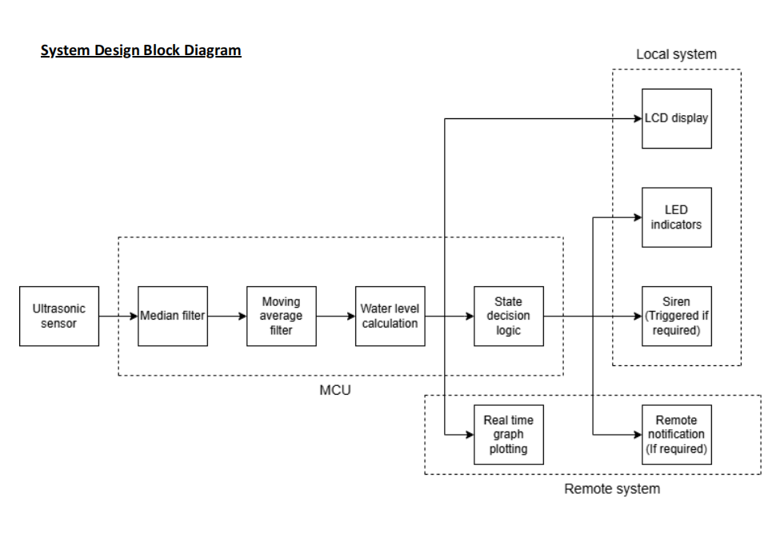
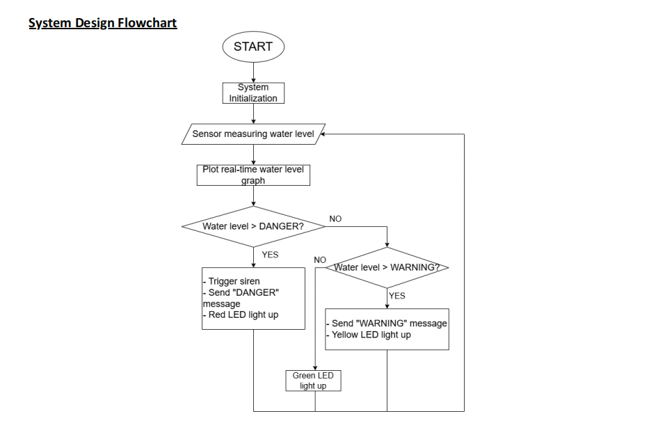
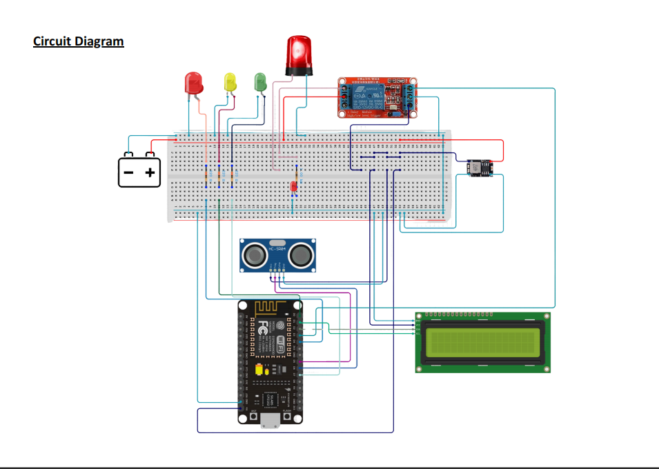

# AQUASS: Flood Detection & Early Warning System 🌊

AQUASS (Autonomous Quick Alert Safety System) is a **real-time IoT-based flood monitoring and early warning system** designed to detect rising water levels and provide timely alerts to prevent potential flood hazards.

Developed as part of the **SEMM4533 System Design Project**, this system integrates **ultrasonic sensing, embedded systems, and cloud communication** to deliver reliable flood monitoring and notification.

The system continuously measures water levels and sends alerts through **Blynk** and **Telegram**, ensuring both **local and remote users receive early warnings**.

---

# 📷 Project Preview

## System Architecture



## System Flow Logic



## Circuit Diagram



---

# 📖 Project Background

Flooding is a common hazard for **campsites and low-lying recreational areas**, especially during heavy rainfall. Existing flood alert systems typically operate at a **regional scale**, which often leads to delayed warnings for specific locations.

The **AQUASS system** was developed to address this problem by providing:

- **Real-time local monitoring**
- **Automated decision-making**
- **Immediate on-site and remote alerts**

By combining **embedded sensing technology with IoT communication**, the system provides **fast, reliable, and localized flood warnings** that help users respond before water levels become dangerous.

---

# 🚨 Key Features

## Three-Stage Alert System

The system uses a **multi-level alert mechanism** to improve situational awareness.

| Status | Indicator | Action |
|------|------|------|
| Safe 🟢 | Green LED | Water level within normal range |
| Warning 🟡 | Yellow LED | Blynk & Telegram notification sent |
| Danger 🔴 | Red LED + Siren | Immediate flood alert & evacuation warning |

---

## Dual-Platform IoT Notifications

The system integrates two communication platforms:

**Blynk**
- Real-time water level visualization
- Remote monitoring dashboard
- Event logging

**Telegram Bot**
- Instant alert notifications
- Remote monitoring through messaging
- Emergency warning broadcast

This ensures alerts reach users **even when they are not near the device**.

---

## Anti-False-Alarm Logic

Environmental disturbances such as **ripples, waves, or debris** can cause false sensor readings.

To improve reliability, the system implements:

- **Median Filter**
- **Moving Average Filter**
- **Danger confirmation counter (`dangerCount`)**

The system requires **20 consecutive detection cycles (~2 seconds)** before triggering a danger alert, preventing false alarms caused by transient disturbances.

---

# 🛠 Hardware Components

| Component | Description |
|------|------|
| ESP8266 | Microcontroller with WiFi capability |
| Ultrasonic Sensor (HC-SR04) | Water level distance measurement |
| LEDs | Visual alert indicators |
| Relay Module | Activates siren |
| Siren/Buzzer | Audible emergency alert |
| IP65 Enclosure | Weather-resistant protection |

---

# 💻 Software & Libraries

The system is developed using **Arduino IDE** with the following libraries:

```

ESP8266WiFi
BlynkSimpleEsp8266
LiquidCrystal_I2C
UniversalTelegramBot
ArduinoJson
Wire

````

---

# ⚙️ Installation & Usage

## 1️⃣ Clone the Repository

```bash
git clone https://github.com/LawranceSim/AQUASS-Flood-Detection-Alert-System.git
````

---

## 2️⃣ Configure Credentials in the Code

Update the following parameters inside the source code:

* WiFi SSID & password
* Blynk Template ID
* Blynk Auth Token
* Telegram Bot Token
* Telegram Chat ID

---

## 3️⃣ Upload Code to ESP8266

1. Open the project in **Arduino IDE**
2. Select **ESP8266 board**
3. Upload the firmware to the microcontroller

---

## 4️⃣ Power On the System

After uploading the code:

* Power the ESP8266
* Ensure WiFi connection is established
* Verify LED status indicators

---

## 5️⃣ Test Flood Detection

Simulate rising water levels to verify:

* LED state transitions
* Blynk dashboard updates
* Telegram alert notifications
* Siren activation during danger level

---

# 📂 Project Structure

```
AQUASS-Flood-Detection-Alert-System
│
├── README.md
├── LICENSE
│
├── code
│   └── AQUASS-Flood-Detection-Alert-System.ino
│
├── docs
│   ├── Block_Diagram.png
│   ├── Circuit_Diagram.png
│   ├── System_Flowchart.png
│   └── System Design Project Portfolio (Group 7, AQUASS).pdf
│
├── images
│   ├── prototype_photo.jpg
│
└── hardware
    └── wiring_notes.md
```

---

# 📄 Documentation

Full design documentation is available here:

**Project Portfolio**

```
docs/AQUASS_Project_Portfolio.pdf
```

The document includes:

* Problem definition
* Product Design Specification (PDS)
* Concept generation
* System design process
* Hardware design
* Testing methodology

---

## 👥 Team & Contributions

This project was developed by **Group 7** for the **SEMM4533 System Design course**.

| Member | Contribution |
|------|------|
| **Lawrance Sim Lip We** | Communication & Data Systems Lead – IoT platform integration (Blynk & Telegram), three-stage alert system, anti-false-alarm logic, and system code integration |
| **Hew Yee Hang** | Electronics & Signal Processing Lead – Circuit implementation and sensor signal stabilization using Median and Moving Average filters |
| **Kelvin Lim Dong Xhian** | Prototype Development & Documentation – Physical system assembly and preparation of project documentation |
| **Liew Shan Jie** | Prototype Development & Documentation – Hardware setup, system integration, and documentation |
| **Pang Zi Hao** | Mechanical Design Lead – SolidWorks 3D modeling and mechanical design of the enclosure and mounting structure |

---

# 🎓 Key Lessons Learned

Through this project, we gained valuable experience in:

* **Embedded Systems Integration**
* **IoT Communication Design**
* **Signal Processing for Sensor Stability**
* **System-Level Engineering Design**

Most importantly, the project highlighted that **reliable communication is critical in safety systems**, where accurate and timely alerts can significantly reduce risks.

---

# 🌍 SDG Alignment

This project supports:

**SDG 11 – Sustainable Cities and Communities**
**SDG 13 – Climate Action**

By improving **early flood detection and disaster preparedness**.

---

# 📜 License

This project is licensed under the **MIT License**.

```
